# TMA Cabinet Contents

## Pier cabinet TMA-PI-CS-CBT-0101

The cabinet is located at level 6 inside the pier. The main purpose of this cabinet is to gather several signals from
the pier fixed part and communicate then to the MCS.

### Location

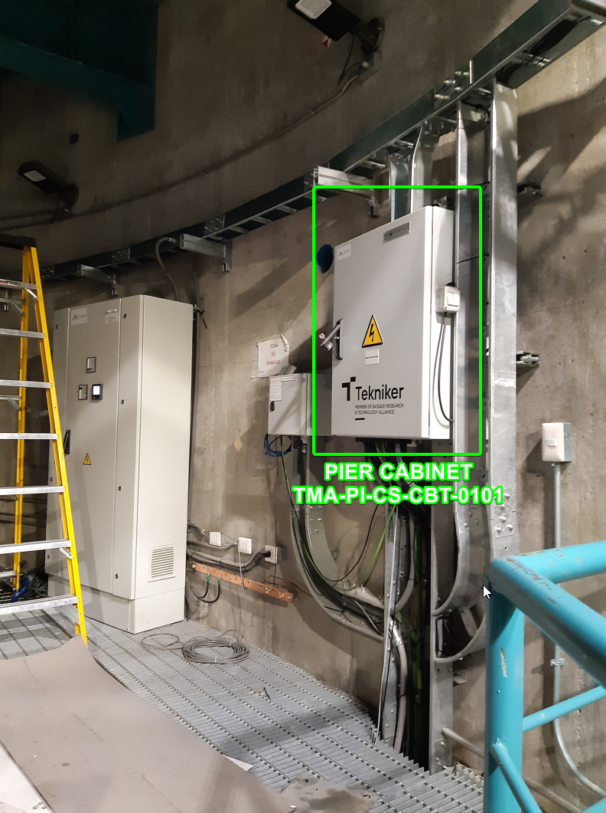

### Contents

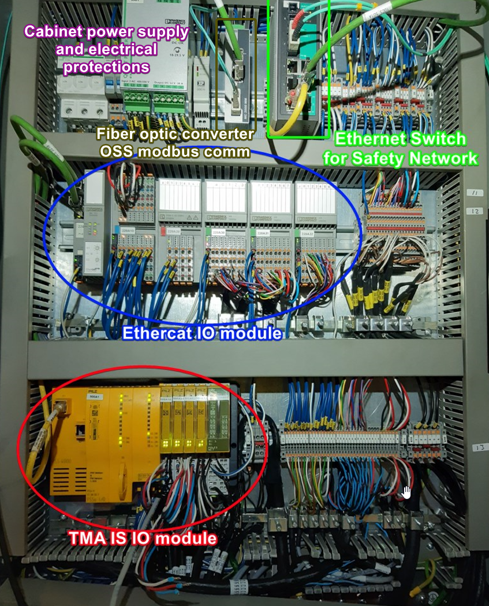

## Azimuth Main Cabinet TMA-AZ-CS-CBT-0001

This cabinet is located on the Azimuth platform under one of the deployable platforms. This is the main cabinet for the
TMA MCS and contains all the main controllers:

- PXIs: TMA, AUX and AXES
- Bosch controller + drives (ACW,CCW)
- Safety controller, TMA IS
- Ethercat I/O module
- Ethercat drives line start, cRIO
- EIB, one for both AZ and EL
- Thermal control
- Ethernet switches

### Location

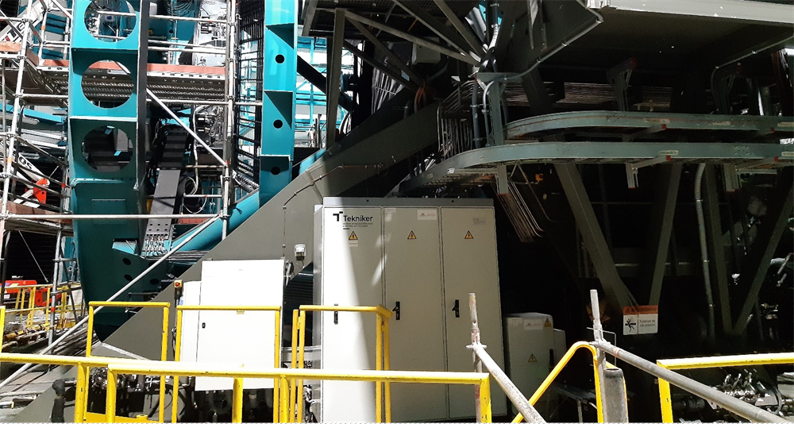

### Contents

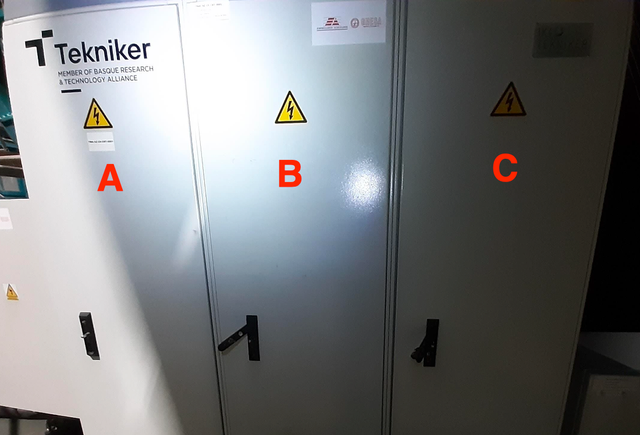

#### Door A

The top part of this door, which is not visible in the picture below, contains the power supplies for the cabinet as
well as the electrical protections for the cabinet.

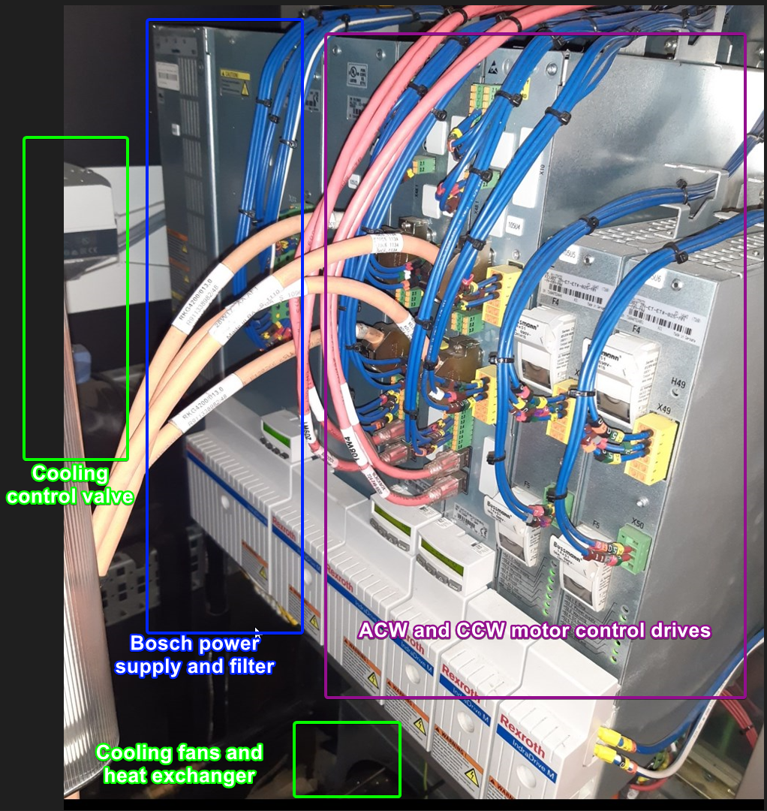

#### Door B

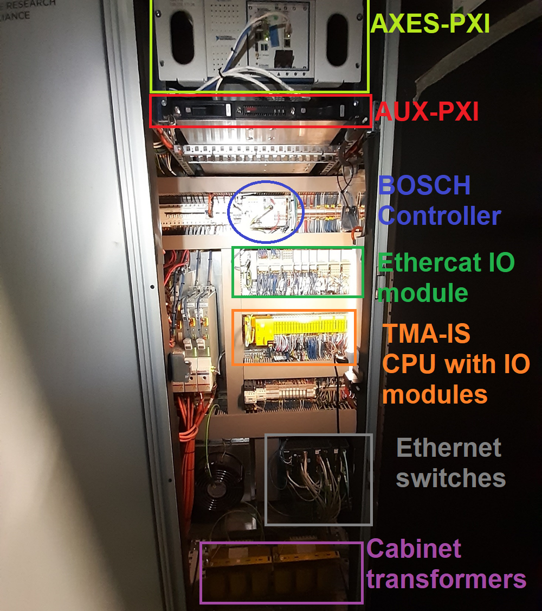

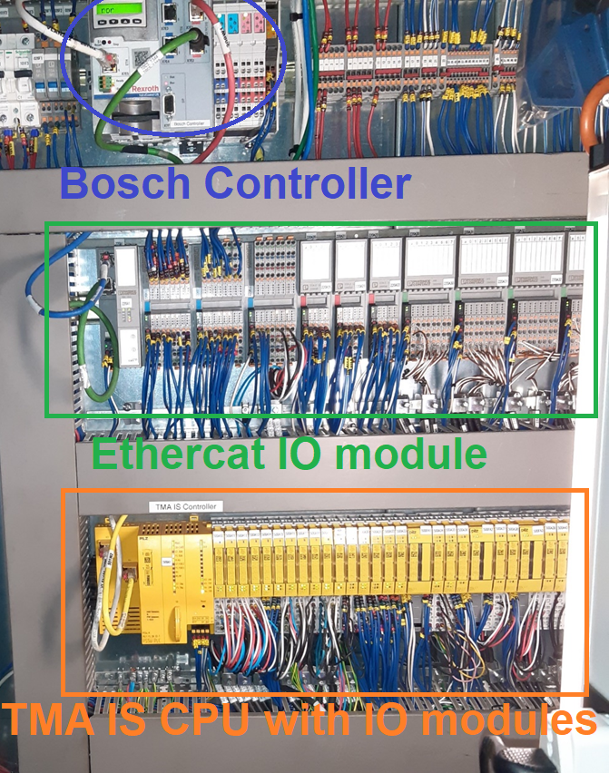

#### Door C

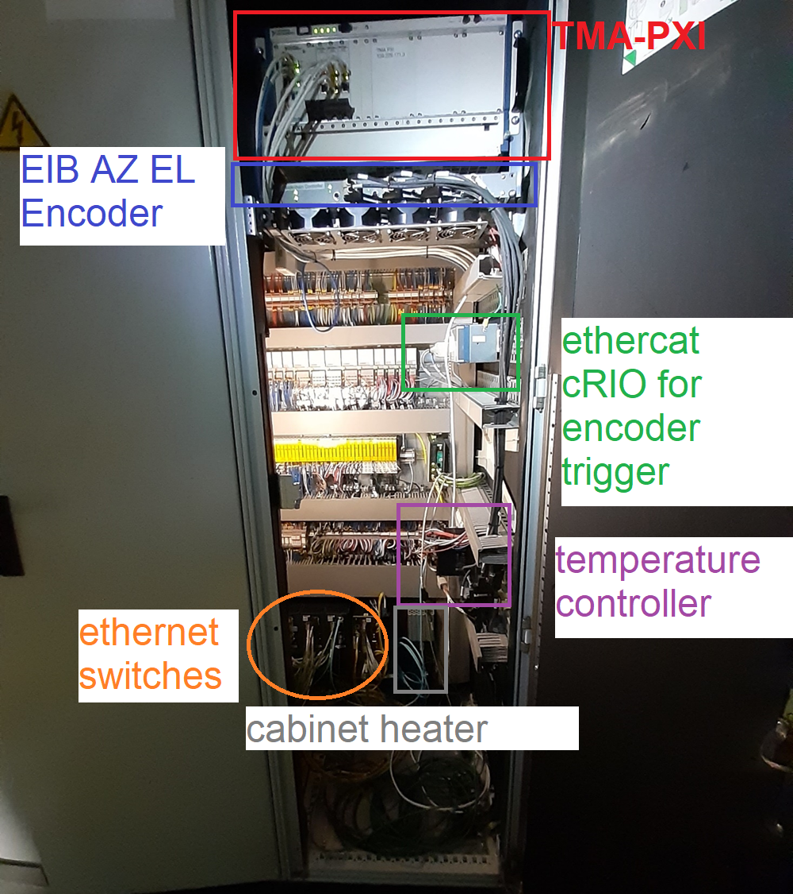

## Azimuth Cabinet 0101 TMA-AZ-CS-CBT-0101

This cabinet is located on the Azimuth platform under one of the elevation supports. The main purpose of this cabinet is
to gather several signals from the azimuth side in which it's located and communicate then to the MCS.

### Location

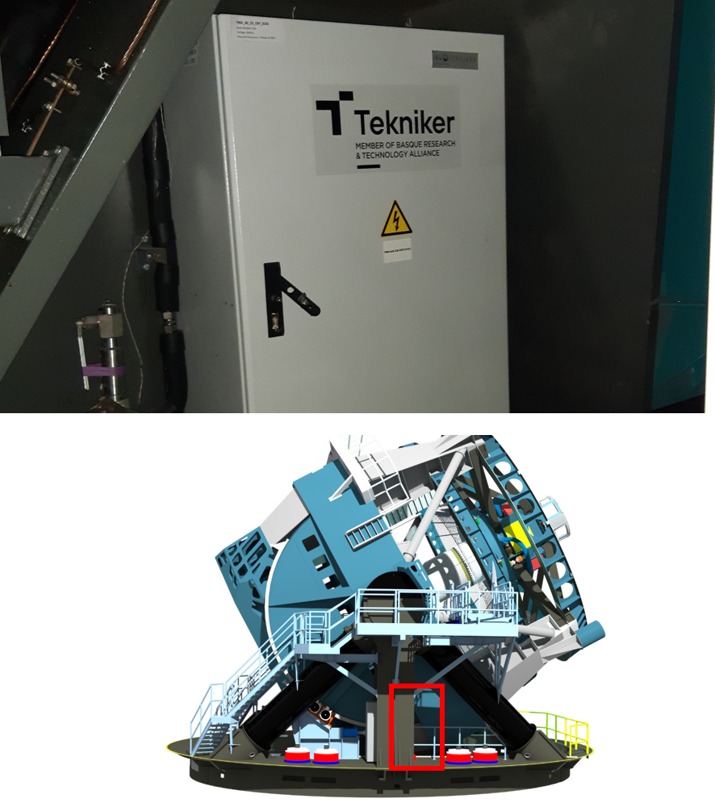

### Contents

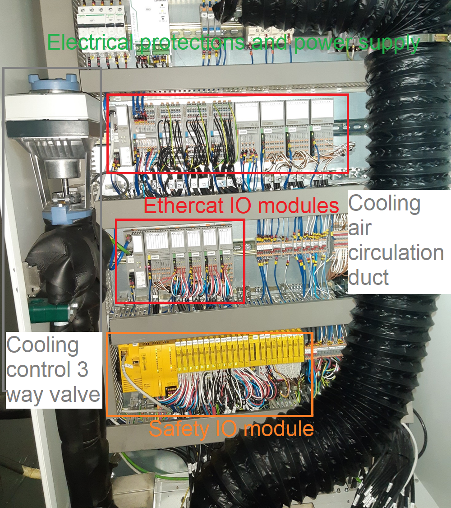

## Elevation Cabinets TMA-EL-CS-CBT-0101 & TMA-EL-CS-CBT-0102

These two cabinets are located inside the CST. The main purpose of these cabinets is to gather several signals from the
elevation part and communicate then to the MCS.

### Location

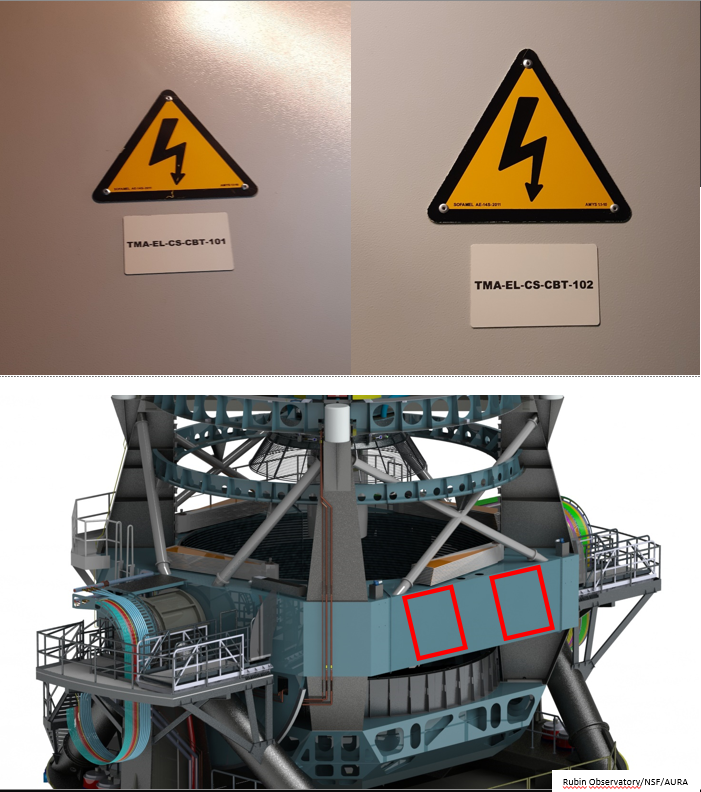

### Contents

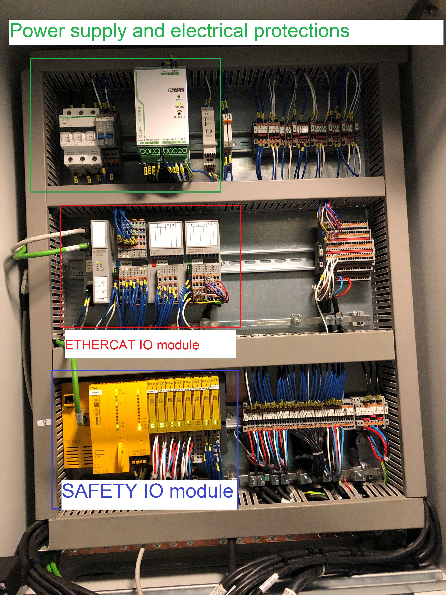

## Phase main cabinet TMA-AZ-DR-CBT-0001

This is the main cabinet for the drives, which contains the power supply used to charge the capacitor banks.
This cabinet is located on the Azimuth platform under one of the deployable platforms.

### Location

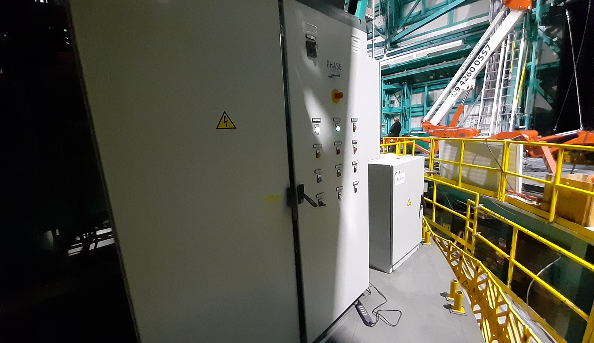

### Contents

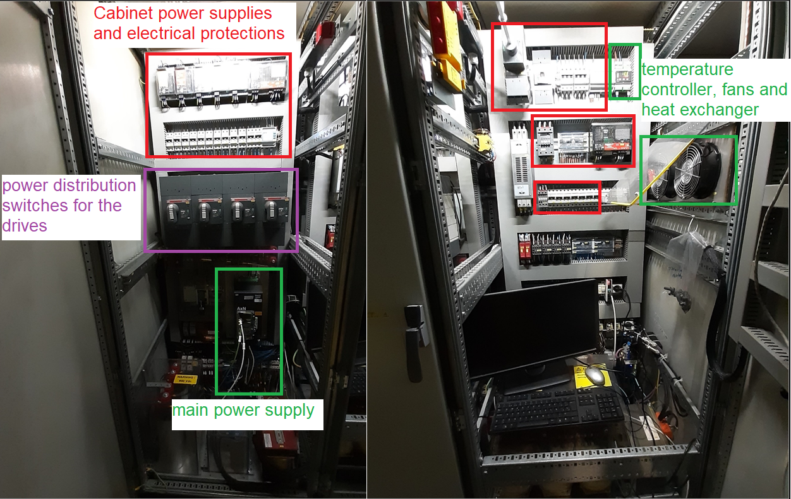
